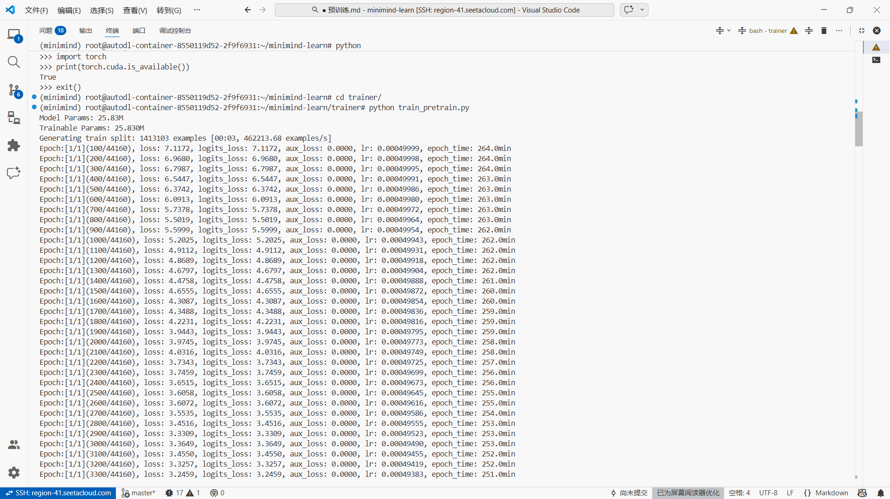
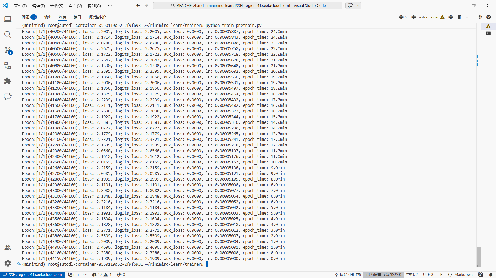

训练之前先简单看了一下数据集的结构

{"text": "鉴别一组中文文章的风格和特点，例如官方、口语、文言等。需要提供样例文章才能准确鉴别不同的风格和特点。<|im_end|> 好的，现在帮我查一下今天的天气怎么样?今天的天气依据地区而异。请问你需要我帮你查询哪个地区的天气呢？<|im_end|> 打开闹钟功能，定一个明天早上七点的闹钟。好的，我已经帮您打开闹钟功能，闹钟将在明天早上七点准时响起。<|im_end|> 为以下场景写一句话描述：一个孤独的老人坐在公园长椅上看着远处。一位孤独的老人坐在公园长椅上凝视远方。<|im_end|> 非常感谢你的回答。请告诉我，这些数据是关于什么主题的？这些数据是关于不同年龄段的男女人口比例分布的。<|im_end|> 帮我想一个有趣的标题。这个挺有趣的：\"如何成为一名成功的魔术师\" 调皮的标题往往会吸引读者的注意力。<|im_end|> 回答一个问题，地球的半径是多少？地球的平均半径约为6371公里，这是地球自赤道到两极的距离的平均值。<|im_end|> 识别文本中的语气，并将其分类为喜悦、悲伤、惊异等。\n文本：“今天是我的生日！”这个文本的语气是喜悦。<|im_end|>"}

